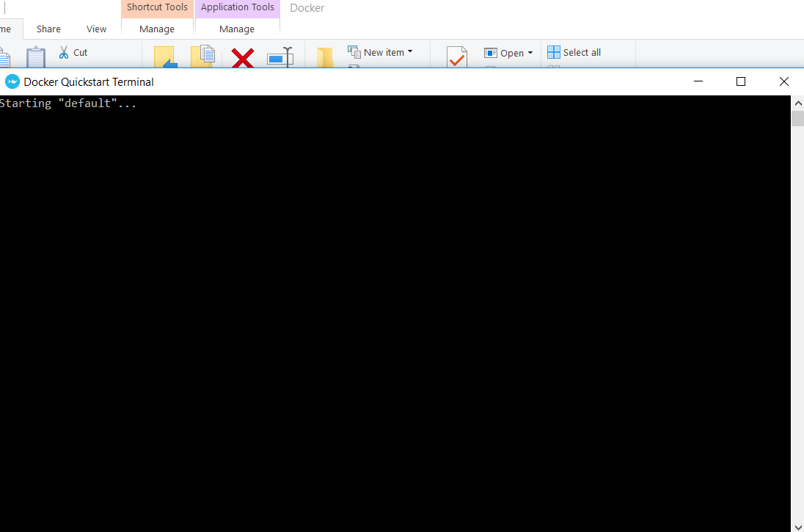
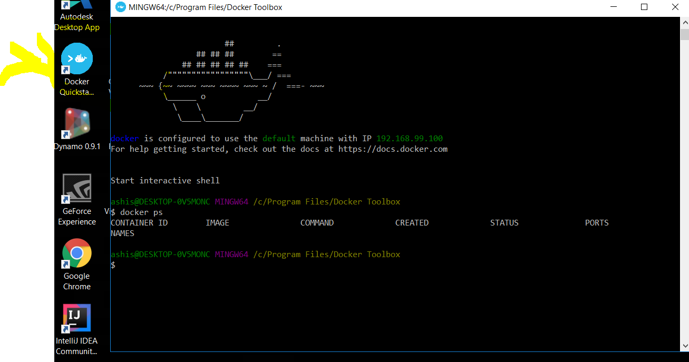
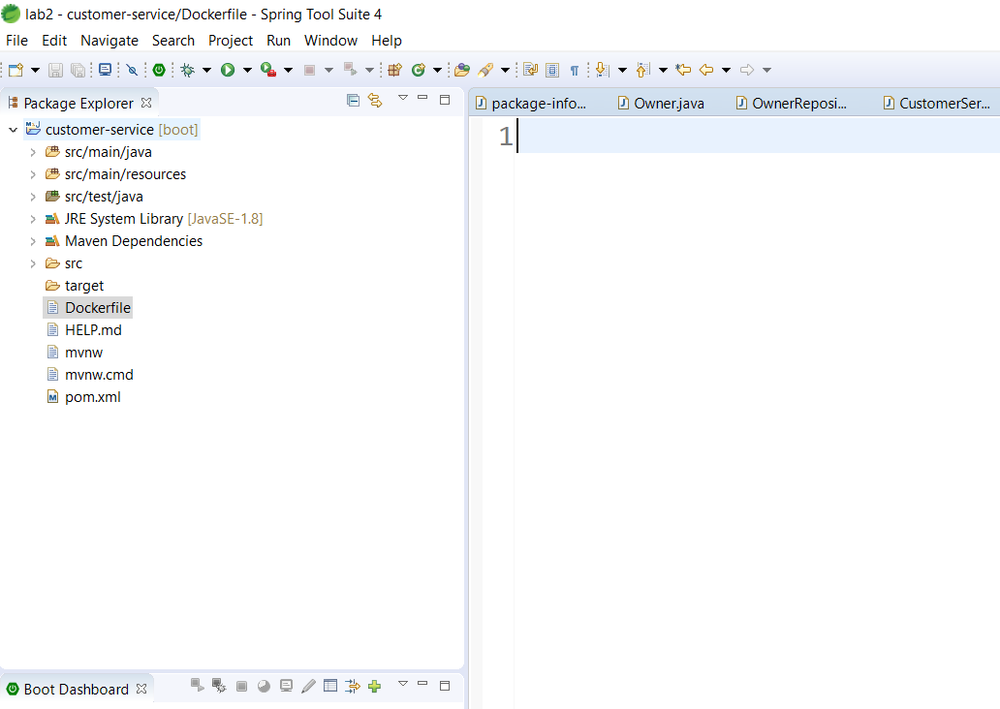

# Windows

Make sure Docker Toolbox is used and not Docker Machine. Docker Toolbox has been deprecated but will be used for our lab excercise.

https://github.com/docker/toolbox/releases

# Windows 7

# Windows 10

Disable Hyper V.

# Check completition

Launch Quickstart Terminal as shown in below screen

Type command 

      docker run hello-world
    
# Docker

# Microservice and Docker

Open your Spring Boot Java microservice code 

Create file called Dockerfile in same folder where pom.xml exists.
Make sure your jar name and Port exposed matches to spring project you have created.

      FROM openjdk:8-jdk-alpine
      MAINTAINER ashishwaghmare@gmail.com
      # copy files
      COPY ./target/customer-service-0.0.1-SNAPSHOT.jar app.jar 
      ENTRYPOINT ["java","-jar","/app.jar"]
      # ExposePorts
      EXPOSE 8080

Jump to folder which has your micro-service code. For me it was this path

      C:\Users\ashis\Documents\lab2\customer-service

Convert that to Unix like path and Docker Quickstart terminal

      cd /C/Users/ashis/Documents/lab2/customer-service
 
 Open Docker quickstart terminal
 
 
      
Now type command below in Docker Quickstart terminal
      
       docker build . -t customer-service
       
 Now expose the service to port you want, for my case 
 
       docker run  -p 9090:8080 customer-service
       
       
 Check your browser if below URL are up and running 
      
1. http://192.168.99.100:9090/owners
1. http://192.168.99.100:9090/owners/1
1. http://192.168.99.100:9090/owners/2
       

      
