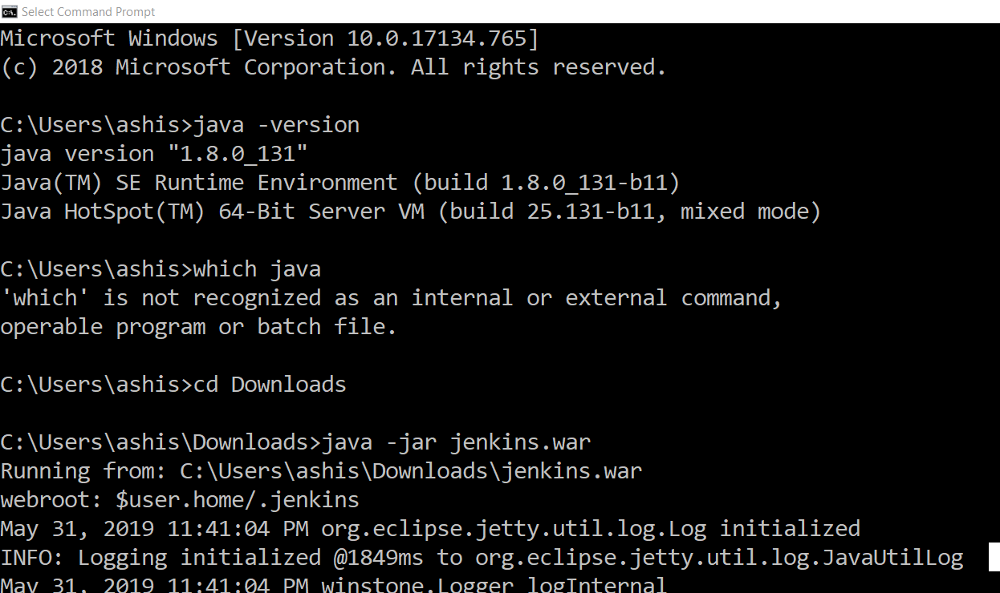
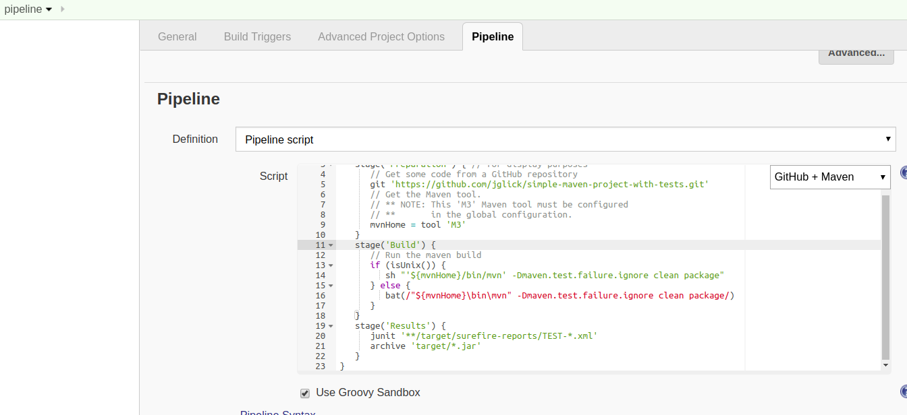

# Jenkins

Make sure mchine running Jenkins has 
1. java is correctly installed
1. mvn is correctly installed

## Install and configure Jenkins

1. Download latest jenkins from machine

1. Open command line and launch jenkins


      java -jar jenkins.war
      
## Setup M3 in Jenkins


Finishing insert should look like below




### Create a maven project for TestNG

Modify maven project remove Junit dependency and add below

   		 <dependency>
			<groupId>org.testng</groupId>
			<artifactId>testng</artifactId>
			<version>6.8.5</version>
		</dependency>
    
### Add TestNG test suite in the project
### Integrate it with Jenkins

# Extra (not part of Session Labs)
## Selenium TestNG working example

```groovy
node {
   def mvnHome
   stage('Preparation') { // for display purposes
      // Get some code from a GitHub repository
      git 'https://github.com/apptitude-in/Java-Selenium-TestNG-Automation-Framework.git'
      // Get the Maven tool.
      // ** NOTE: This 'M3' Maven tool must be configured
      // **       in the global configuration.           
      mvnHome = tool 'M3'
   }
   stage('Build') {
      // Run the maven build
      if (isUnix()) {
         sh "'${mvnHome}/bin/mvn' -Dmaven.test.failure.ignore clean package -Pdev"
      } else {
         bat(/"${mvnHome}\bin\mvn" -Dmaven.test.failure.ignore clean package -Pdev/)
      }
   }
   stage('Results') {
      junit '**/target/surefire-reports/TEST-*.xml'
      archive 'target/*.jar'
   }
}

